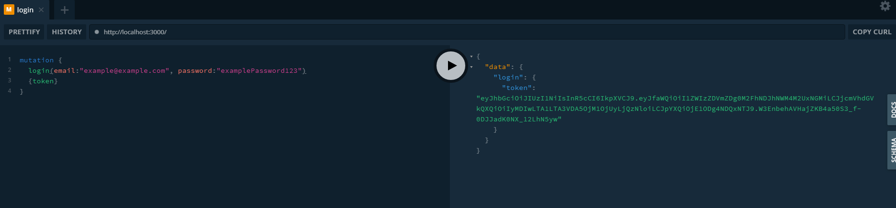

## Login, Signup and JWT Authentication example on Apollo server

- :heavy_check_mark: Apollo Server

- :heavy_check_mark: GraphQL

- :heavy_check_mark: MongoDB

- :heavy_check_mark: JWT Authentication

- :heavy_check_mark: PBKDF2

### Screenshots

#### :fire:	Signup Mutation

#### :fire:	Login Mutation

#### :fire:	Get Users Query

